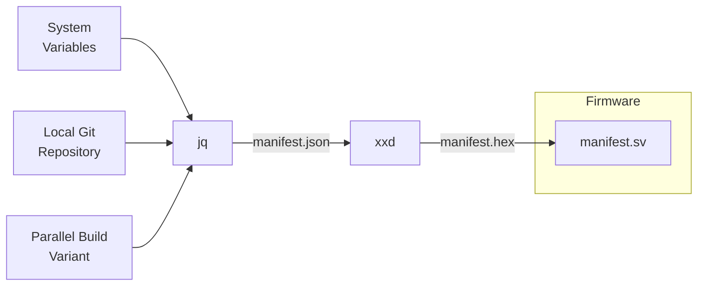
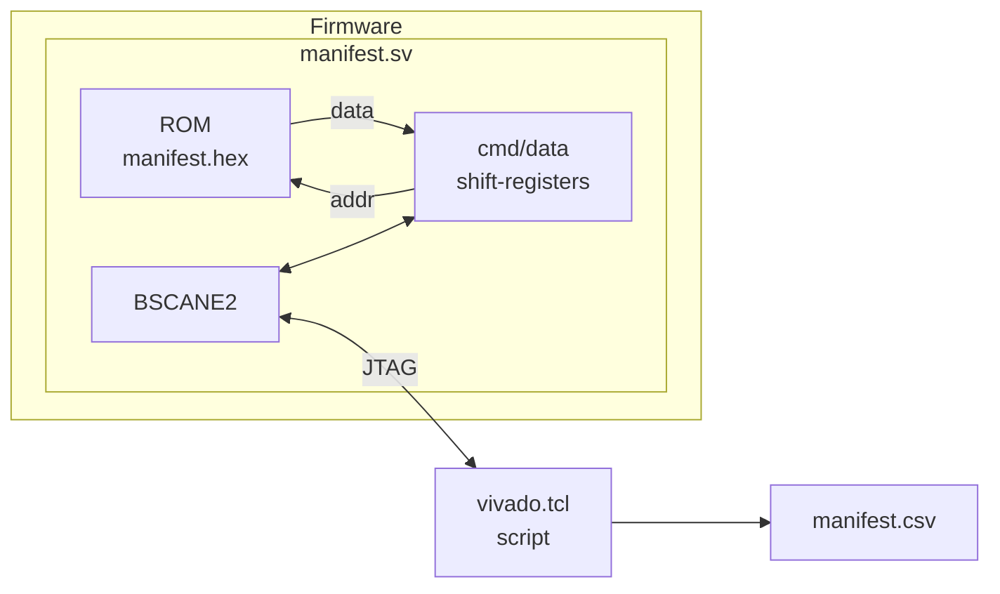

Firmware JSON manifest example:

```json
{
  "build": {
    "timestamp": "251117T125105Z",
    "user": "mm",
    "host": "t480a",
    "job_id": "undefined",
    "toolchain": "/opt/Xilinx/2025.1/Vivado/bin/vivado"
  },
  "git": {
    "local_repo_state": "dirty",
    "branch": "main",
    "tag": "no-tag-matching-6ebd9e53",
    "release": "undefined",
    "commit": "6ebd9e539693f3458e114eac9839365e0386d301",
    "remote": "git@github.com:MatthieuMichon/fpga-fw-manifest.git"
  },
  "top_level_parameters": {
    "variant_hex32": "0xAA55CC33",
    "variant_str": "passing-string-values-via-verilog-generics-is-ok-or-is-it-question-mark"
  }
}
```

# Rationale

Large-scale FPGA firmware build farms can yield thousands of bitstream files on a weekly basis. Anyone in this line of work has (or eventually will) run into the issue of tracing a bitstream loaded into an FPGA board to its origins. The projected hosted in this repository is my submission for addressing such problems.

## Value Proposition

Rather then relying on a set of memory-mapped registers and making all kinds of compromises, I **proudly** decided to go for a totally different approach.

- [x] Independent from the memory mapping *du jour*
- [x] Safe from any library / API compatibility issues
- [x] Not limited to fixed-length fields
- [x] Self-contained module decoupled from the rest of the design
- [x] Frugal usage of logic resources
- [x] Easy to port across vendors / families
- [x] Compatible with any file formats (I went ahead with JSON)

# Quick Start

By default, the firmware is built and uploaded to the first JTAG device found. Contents of manifest are then read back and written to a `manifest.csv` file.

```shell
make

# Other devices can be targeted:
#   make PART=xcku5p-ffvb676-3-e
# IMPORTANT: JTAG chain IR and DR lengths **must** match board / device
```

# Theory of Operation

1. The [makefile](/Makefile) defines variables relevant for inclusion in the manifest and generates an hex-string `manifest.hex` of the corresponding JSON key / value mapping.
2. The Vivado build script [`vivado.tcl`](/src/vivado.tcl) builds the FPGA firmware into a bitstream file `fpag.bit`.
3. The same script opens the first JTAG chain and programs the FPGA with the bitstream, then selects the proper `BSCANE2` instance connected to the manifest ROM readback logic and proceeds the read all the non-zero contents into a CSV file `manifest.csv`

JSON manifest loading flowchart:



JSON manifest download flowchart:



Optimized logic implementation of the `manifest` module.


# Caveats

- All `BSCANE2` primitives present in a design must have a unique JTAG chain index (defined with the `JTAG_CHAIN` parameter). Some features provided by the toolchain use their own `BSCANE2` with a hard-coded `JTAG_CHAIN` value:

| `JTAG_CHAIN` | Usage by Xilinx                                       |
|--------------|-------------------------------------------------------|
| 1            | Debug tools (ILA, VIO and JTAG/AXI cores), MIG Status |
| 2            | Microblaze Debug Module (default setting)             |
| 3            | *Usualy available*                                    |
| 4            | *Usualy available*                                    |
